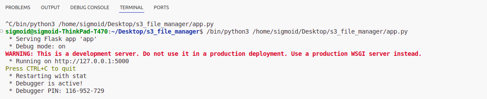
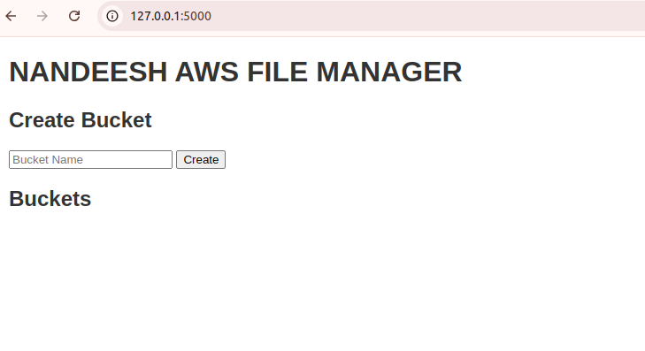
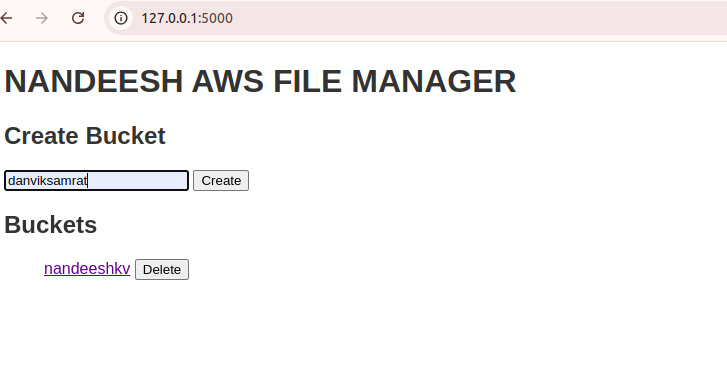

# THIS IS AN EXAMPLE OF PUSH TO GIT 
This is an exmaple to push to the github
use commands to push the projects to the github
use cheat sheet to know the commands 
execute the every command in the vs code
 
 
 
